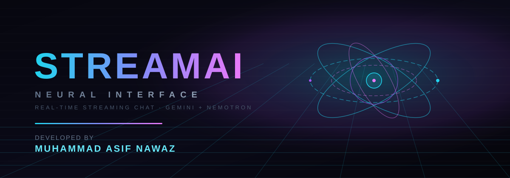
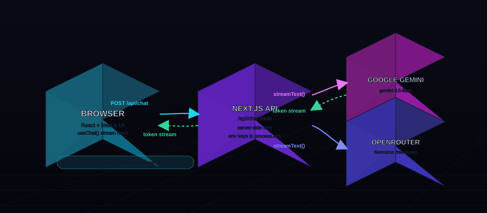

# STREAMAI — Real-Time Streaming AI Chatbot

> **🚀 Live demo:** [https://stream-ai-chat.vercel.app](https://stream-ai-chat.vercel.app)
>
> [](https://stream-ai-chat.vercel.app)
> [](https://nextjs.org)
> []()

A futuristic, cyberpunk-styled AI chat application built with **Next.js 15 (App Router)**, **React 19**, and the **Vercel AI SDK**. It streams responses token-by-token from **Google Gemini** and **OpenRouter (Nemotron)** straight into a neon-soaked 3D interface.



## What this project is

STREAMAI is a full-stack streaming chat app wrapped in a "neural interface" aesthetic:

- a **3D revolving hologram** rendered live behind the chat (Three.js + React Three Fiber),
- a **login / signup** flow (demo auth, stored locally in the browser),
- **multi-model support** — pick Gemini or Nemotron from the composer,
- **conversation history** saved per browser, with a sidebar to resume, rename, or delete chats,
- **transparent key failover** — if the primary provider key is dead or quota-exhausted, the app silently retries with the next configured key.

Everything is **server-rendered** except the components that need the browser (the hologram and the streaming hook), and the API keys live **only on the server** — they never reach the browser bundle.

## Features

| Feature | Details |
|---|---|
| Real-time streaming | Token-by-token output via the Vercel AI SDK text protocol |
| Two providers | Google Gemini (default) and OpenRouter / Nemotron |
| Key failover | `API_KEY`, then `API_KEY_2` — automatic on invalid/expired/quota errors |
| Login / Signup | Frontend demo auth — username + password stored in `localStorage` |
| Chat history | Conversations persist in the browser; resume, delete, new chat |
| 3D hologram | Revolving wireframe icosahedron, rings and particles behind the UI |
| Cyberpunk UI | Animated neon borders, perspective grid, scanlines, starfield |
| Markdown replies | Responses rendered with `react-markdown` + GFM (code blocks, tables) |
| Fully responsive | Mobile-first layout, collapsible history sidebar |

## How it works



1. The **browser** sends the conversation and the selected model to `POST /api/chat` through the `useChat()` hook.
2. The **Next.js Route Handler** (server-only) converts the UI messages, builds a model instance with the appropriate API key, and calls `streamText()`.
3. The provider streams tokens back; the route returns a plain-text stream that the hook consumes and renders live.
4. **Sessions and history never touch a database** — everything lives in `localStorage` in the browser.

The route handler is deliberately thin and defensive: it validates the payload, falls back to a sensible default model if none is chosen, and returns a clean 500 with a human-readable message when every configured key fails.

## Tech stack

- **Framework:** Next.js 15 (App Router) + React 19
- **AI SDK:** `ai`, `@ai-sdk/google`, `@ai-sdk/openai-compatible`, `@ai-sdk/react`
- **3D:** Three.js + `@react-three/fiber`
- **Rendering:** `react-markdown` + `remark-gfm`
- **Styling:** Tailwind CSS 3 + custom CSS keyframe animations
- **Icons:** lucide-react
- **Language:** TypeScript (strict)

## Getting started

### Prerequisites

- Node.js 18.18+ (20 LTS recommended)
- npm

### 1. Install dependencies

```bash
npm install
```

### 2. Configure environment variables

Copy the example file and fill in your keys:

```bash
cp .env.example .env.local
```

| Variable | Required | Purpose |
|---|---|---|
| `GOOGLE_GENERATIVE_AI_API_KEY` | Yes (for Gemini) | Primary Google key — get one at [Google AI Studio](https://aistudio.google.com/apikey) |
| `GOOGLE_GENERATIVE_AI_API_KEY_2` | No | Fallback Gemini key, used automatically on failure |
| `GOOGLE_GENERATIVE_AI_MODEL` | No | Override the Gemini model id (default: `gemini-3.5-flash`) |
| `OPENROUTER_API_KEY` | No | Enables the Nemotron / OpenRouter model — [openrouter.ai/keys](https://openrouter.ai/keys) |
| `OPENROUTER_API_KEY_2` | No | Fallback OpenRouter key |
| `OPENROUTER_MODEL` | No | Override the OpenRouter model id |

> **Never commit real keys.** `.env.local` is gitignored — the repo only ships `.env.example` with placeholders.

### 3. Run in development

```bash
npm run dev
```

Open [http://localhost:3000](http://localhost:3000), sign up with any username/password, and start chatting.

### 4. Other scripts

```bash
npm run build      # production build
npm run start      # serve the production build
npm run typecheck  # strict TypeScript check (tsc --noEmit)
```

## Deployment on Vercel

This is a standard Next.js app, so Vercel picks it up automatically:

1. Push this repository to GitHub.
2. Import it at [vercel.com](https://vercel.com) — framework auto-detected, keep `npm run build`.
3. Add the environment variables from the table above (same names, your real values) under **Project → Settings → Environment Variables**.
4. Deploy. The `/api/chat` route already sets `maxDuration = 60`, so long streams are fine on the free tier.

Keys are read from `process.env` on the server only — nothing is embedded in the client bundle.

## Security notes

- **API keys stay server-side.** The provider modules are only ever imported by the Route Handler; no client component touches them.
- **Demo auth is not real auth.** Credentials are stored in plain text in `localStorage` purely for demonstration. Do not use this pattern for production.
- **Free-tier keys still need care.** A leaked key can be used to burn your quota and take the app offline, and abuse is traced to your account. If you ever suspect a leak, regenerate the key at the provider and update the environment variable.
- **Type safety is enforced.** `npm run typecheck` runs strict `tsc` with zero `any`.

## Project structure

```
app/
  components/        # ChatInterface, ChatMessage, HistorySidebar, Hologram, ...
  login/page.tsx     # Login / Signup card
  api/chat/route.ts  # Server-only streaming route with key failover
lib/
  auth.ts            # Demo auth (localStorage)
  ai-config.ts       # Server-side provider + key configuration
  chat-history.ts    # Conversation persistence helpers
  chat-meta.ts       # Model metadata
assets/              # README diagrams
```

## Roadmap ideas

- [ ] Real authentication (NextAuth / database)
- [ ] Persistent server-side conversation storage
- [ ] More models and custom system prompts
- [ ] Voice input

---

## Developed by **Muhammad Asif Nawaz**

Built with care, caffeine, and far too many shades of cyan and magenta.

The chatbot knows who its creator is — just ask it **"who made you?"** or **"tell me about your developer"** and it will introduce Muhammad Asif Nawaz with the details below.

**Connect with me:**
- 💼 **LinkedIn:** [muhammad-asif-nawaz-](https://www.linkedin.com/in/muhammad-asif-nawaz-)
- 🐙 **GitHub:** [asifnawaz23](https://github.com/asifnawaz23)
- ✉️ **Email:** [masifnawaz815@gmail.com](mailto:masifnawaz815@gmail.com)
- 🌐 **Live project:** [stream-ai-chat.vercel.app](https://stream-ai-chat.vercel.app)

---

*This is a learning / portfolio project. The auth layer is a frontend demo only — do not use it to protect real user data.*
